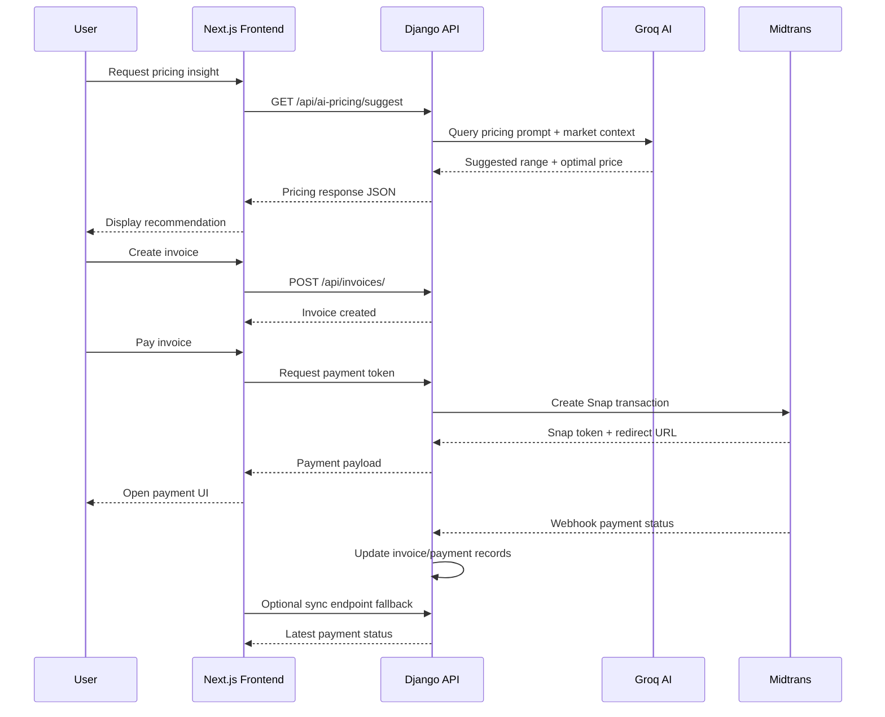

# Kreavify


## Overview

Kreavify is an end-to-end platform for creative professionals and freelancers in Indonesia. It helps users manage services, portfolio items, invoices, contracts, tax reporting, and payments from one place.

The project combines modern full-stack web development with AI-assisted business intelligence. In addition to operational workflows, it provides intelligent pricing suggestions and revenue forecasting to support better decision-making.

## Core Features

- Service and portfolio management for personal creative offerings.
- Smart invoicing with tax-aware calculations (including UMKM PPh Final 0.5%).
- AI pricing assistant powered by Groq for market-aware recommendations.
- Built-in payment flow via Midtrans (Snap and webhook-based status updates).
- Revenue forecasting and pricing analysis through ML endpoints.
- Contract generation and tracking between creator and client.
- Bilingual UX support (English and Bahasa Indonesia) through i18n utilities.
- Dashboard analytics to monitor finances, project activity, and growth signals.

## Tech Stack

### Frontend

- Next.js 16 (App Router)
- React 19
- CSS Modules
- Recharts
- Framer Motion
- Lucide React
- Custom i18n context + JSON locale files

### Backend

- Django 5.1
- Django REST Framework (DRF)
- JWT Authentication
- SQLite (development default)
- Midtrans integration (Snap + webhooks)
- Groq API integration for AI pricing
- ML modules for pricing recommendation and revenue forecast

## Architecture Flow

The sequence below shows the primary flow for AI pricing, invoicing, and payment processing.



## Database Model (Conceptual)

Main domain entities:

- User: Extended account profile for freelancers/creators.
- Service: Offer catalog with category, description, and pricing baseline.
- Portfolio: Showcase projects linked to services.
- Invoice: Billing document with amount, due date, tax fields, and status.
- InvoiceItem: Line-level detail for each invoice.
- Payment: Payment transaction metadata and gateway status mapping.
- Contract: Agreement records between creator and client.
- AI/ML Data Fields: Historical performance and profile attributes used for analysis.

## API Reference (Complete)

Base URL (local): http://localhost:8000

### System

- GET /api/health/

### Authentication and User

- POST /api/auth/register/
- POST /api/auth/token/
- POST /api/auth/token/refresh/
- GET /api/auth/me/
- PUT /api/auth/me/
- PATCH /api/auth/me/
- POST /api/auth/password/
- GET /api/p/<slug>/
- POST /api/upload/

### Services

- GET /api/services/
- POST /api/services/
- GET /api/services/<id>/
- PUT /api/services/<id>/
- PATCH /api/services/<id>/
- DELETE /api/services/<id>/

### Portfolio

- GET /api/portfolio/
- POST /api/portfolio/
- GET /api/portfolio/<id>/
- DELETE /api/portfolio/<id>/

### Invoices

- GET /api/invoices/
- POST /api/invoices/
- GET /api/invoices/<uuid>/
- PUT /api/invoices/<uuid>/
- PATCH /api/invoices/<uuid>/
- DELETE /api/invoices/<uuid>/
- POST /api/invoices/<uuid>/send/
- POST /api/invoices/<uuid>/cancel/
- POST /api/invoices/<uuid>/remind/

### Payments

- GET /api/pay/<slug>/
- POST /api/pay/<slug>/checkout/
- POST /api/pay/<slug>/sync/
- POST /api/pay/notification/

### AI Pricing

- POST /api/ai/pricing/
- GET /api/ai/pricing/usage/

### Dashboard

- GET /api/dashboard/
- GET /api/dashboard/tax-report/

### Analytics

- POST /api/analytics/profile-view/
- POST /api/analytics/service-click/
- GET /api/analytics/stats/

### Contracts

- GET /api/contracts/
- GET /api/contracts/<uuid>/
- PUT /api/contracts/<uuid>/
- PATCH /api/contracts/<uuid>/
- DELETE /api/contracts/<uuid>/
- POST /api/contracts/generate/

### ML Insights

- GET /api/ml/revenue-forecast/
- POST /api/ml/pricing-recommendation/
- POST /api/ml/pricing-analysis/
- GET /api/ml/dashboard-insights/

## Getting Started

### Prerequisites

- Node.js 18+
- Python 3.11+
- Midtrans server/client keys
- Groq API key

### 1. Clone Repository

```bash
git clone https://github.com/yoockh/kreavify.git
cd kreavify
```

### 2. Backend Setup

```bash
cd backend
python -m venv venv
source venv/bin/activate
pip install -r requirements.txt
pip install -r requirements-ml.txt
```

Create backend environment file at backend/.env:

```env
DJANGO_SECRET_KEY=your_secret_key
DJANGO_DEBUG=True
DJANGO_ALLOWED_HOSTS=localhost,127.0.0.1
CORS_ALLOWED_ORIGINS=http://localhost:3000

MIDTRANS_SERVER_KEY=your_midtrans_server_key
GROQ_API_KEY=your_groq_api_key
```

Run migrations and start API server:

```bash
python manage.py migrate
python manage.py runserver
```

### 3. Frontend Setup

```bash
cd ../frontend
npm install
```

Create frontend environment file at frontend/.env.local:

```env
NEXT_PUBLIC_API_URL=http://localhost:8000/api
NEXT_PUBLIC_MIDTRANS_CLIENT_KEY=your_midtrans_client_key
```

Start development server:

```bash
npm run dev
```

Application URL: http://localhost:3000

## Recommended Project Commands

- Backend dev server: python manage.py runserver
- Backend tests: python manage.py test
- Frontend dev server: npm run dev
- Frontend lint: npm run lint
- Optional demo data generation:
  - python manage.py generate_demo_data --user-email=you@example.com --months=6

## Deployment Notes

- Replace SQLite with PostgreSQL for production workloads.
- Disable debug mode in production.
- Set secure CORS and allowed hosts configuration.
- Store API keys in a secure secret manager.
- Configure webhook signature verification for payment endpoints.

## Author

[Aisiya Qutwatunnada]("https://github.com/yoockh")

